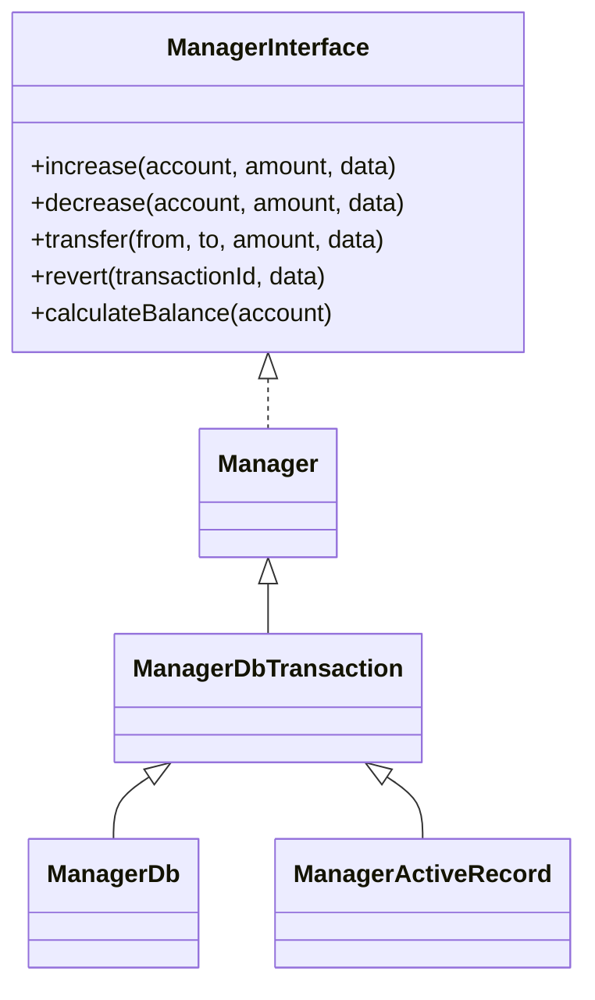

<p align="center">
  <a href="https://github.com/nazbav" target="_blank">
    
  </a>
</p>

<h1 align="center">nazbav/yii2-account-balance</h1>

<p align="center">
  Yii2-расширение для учёта балансов и транзакций по модели дебет/кредит.
  Подходит для кошельков, бонусов, уровней лояльности, реферальных наград и внутренних расчётов.
</p>

## Что это

`nazbav/yii2-account-balance` даёт прикладной слой для безопасных операций:

- `increase()` — начисление;
- `decrease()` — списание;
- `transfer()` — перевод между счётами;
- `revert()` — откат транзакции.

Поддерживаются:

- `ManagerDb` (прямой SQL, MySQL-ориентированный сценарий);
- `ManagerActiveRecord` (через ActiveRecord);
- i18n-сообщения;
- базовые антифрод-контроли и ограничения бизнес-логики.

## Требования

- PHP `^8.1` (проверено на `8.1` и `8.3`);
- Yii2 `~2.0.14`.

## Установка

```bash
composer require nazbav/yii2-account-balance --prefer-dist
```

## Быстрый старт

```php
use nazbav\balance\ManagerDb;

return [
    'components' => [
        'balanceManager' => [
            'class' => ManagerDb::class,
            'accountTable' => '{{%balance_account}}',
            'transactionTable' => '{{%balance_transaction}}',
            'accountLinkAttribute' => 'accountId',
            'amountAttribute' => 'amount',
            'dateAttribute' => 'createdAt',
            'dataAttribute' => 'data',
            'accountBalanceAttribute' => 'balance',
            'extraAccountLinkAttribute' => 'extraAccountId',

            // Рекомендуемые защитные настройки для денежных и бонусных сценариев.
            'requirePositiveAmount' => true,
            'forbidTransferToSameAccount' => true,
            'forbidNegativeBalance' => true,
            'minimumAllowedBalance' => 0,
        ],
    ],
];
```

Пример операций:

```php
$manager = Yii::$app->balanceManager;

$manager->increase(10, 500, ['reason' => 'Пополнение']);
$manager->decrease(10, 100, ['reason' => 'Списание']);
$pair = $manager->transfer(10, 20, 250, ['orderId' => 777]);
$manager->revert($pair[0], ['reason' => 'Отмена операции']);
```

## Полная документация

- [Навигация по документации](docs/README.md)
- [Руководство: быстрый старт и базовая интеграция](docs/tutorial-quick-start.md)
- [Практика: уровни и программы лояльности](docs/howto-loyalty-levels.md)
- [Практика: реферальная программа](docs/howto-referral-program.md)
- [Сложные примеры: начисления, холды, возвраты, уровни](docs/examples-advanced-scenarios.md)
- [Справочник: параметры и контракты](docs/reference-configuration.md)
- [Разбор: риски, антифрод и защита бизнес-логики](docs/explanation-fraud-controls.md)

## Отдельно о реферальной программе

В документации добавлен отдельный прикладной кейс реферальной программы:

- двухсторонняя награда (пригласил + приглашённый);
- отложенная активация награды после окна риска;
- защита от self-referral и дублей;
- лимиты наград на период;
- ручная проверка спорных кейсов.

См. [Практика: реферальная программа](docs/howto-referral-program.md).

## Архитектура



## i18n

Категория сообщений: `nazbav.balance`

Файлы переводов:

- `messages/ru/nazbav.balance.php`
- `messages/en/nazbav.balance.php`

## Безопасность

Базовые меры в библиотеке:

- операции записи выполняются в транзакции;
- проверка суммы (`requirePositiveAmount`), запрет перевода на тот же счёт;
- защита от перерасхода через `forbidNegativeBalance` и `minimumAllowedBalance`;
- атомарные обновления баланса в `ManagerDb`/`ManagerActiveRecord`;
- безопасная сериализация (по умолчанию защита от внедрения объектов);
- статический анализ (`phpstan`), taint-анализ (`psalm`), проверка зависимостей.

Подробно: [Разбор: риски, антифрод и защита бизнес-логики](docs/explanation-fraud-controls.md).

## Проверки

```bash
vendor/bin/phpunit -c phpunit.xml.dist
vendor/bin/phpstan analyse -c phpstan.neon --no-progress
vendor/bin/psalm --taint-analysis --no-cache --output-format=console
```

## Лицензия

BSD-3-Clause. См. [LICENSE.md](LICENSE.md).
