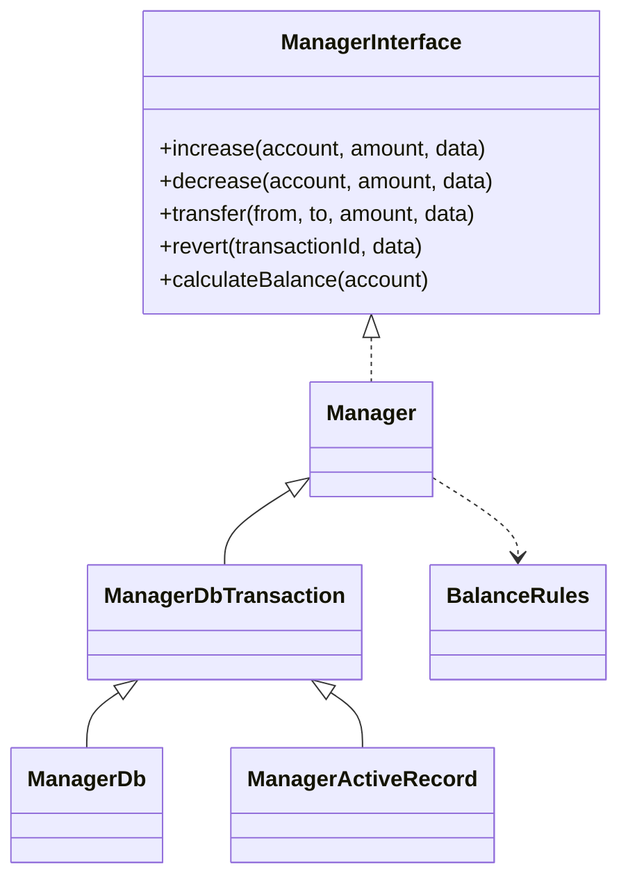
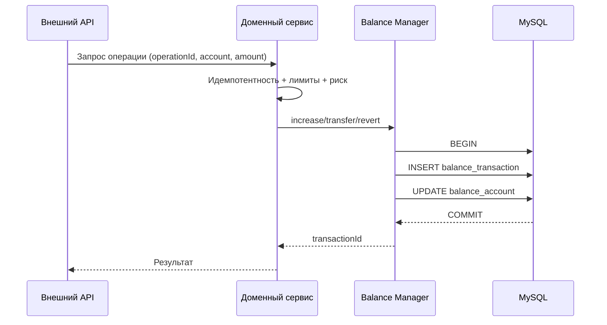

# nazbav/yii2-account-balance

Yii2-расширение для учёта баланса и транзакций по модели дебет/кредит.
Библиотека подходит для денежных кошельков, бонусов, программ лояльности, реферальных начислений и внутренних взаиморасчётов.

## Назначение

Расширение предоставляет единый контракт операций:

- `increase()` — начисление;
- `decrease()` — списание;
- `transfer()` — перевод между счетами;
- `revert()` — откат транзакции;
- `calculateBalance()` — расчёт баланса по истории операций.

Поддерживаются два варианта хранения:

- `ManagerDb` — прямые SQL-операции через `yii\db\Connection` (рекомендуется для MySQL);
- `ManagerActiveRecord` — интеграция через `yii\db\ActiveRecord`.

## Технические требования

- PHP `^8.1` (тестируется в CI на `8.1` и `8.3`);
- Yii2 `~2.0.14`;
- для промышленного режима с `ManagerDb` рекомендуется MySQL `8.0+` (InnoDB).

## Контур качества

- `phpunit` — полный набор unit/integration тестов библиотеки;
- `phpstan` — уровень строгости `8`;
- `psalm --taint-analysis` — контроль taint-потоков;
- `infection` — мутационное тестирование критического ядра (`Manager`, `ManagerDb`, `ManagerActiveRecord`) с требованием `MSI=100` и `Covered MSI=100`;
- GitHub Actions:
  - `.github/workflows/php.yml` — основной pipeline качества;
  - `.github/workflows/security.yml` — security-проверки репозитория.

## Установка

```bash
composer require nazbav/yii2-account-balance --prefer-dist
```

## Быстрый пример конфигурации

```php
use nazbav\balance\ManagerDb;

return [
    'components' => [
        'balanceManager' => [
            'class' => ManagerDb::class,
            'db' => 'db',
            'accountTable' => '{{%balance_account}}',
            'transactionTable' => '{{%balance_transaction}}',
            'accountLinkAttribute' => 'accountId',
            'extraAccountLinkAttribute' => 'extraAccountId',
            'accountBalanceAttribute' => 'balance',
            'amountAttribute' => 'amount',
            'dateAttribute' => 'createdAt',
            'dataAttribute' => 'data',
            'autoCreateAccount' => true,

            // Рекомендуемый профиль безопасности.
            'requirePositiveAmount' => true,
            'forbidTransferToSameAccount' => true,
            'forbidNegativeBalance' => true,
            'forbidDuplicateOperationId' => true,
            'requireOperationId' => true,
            'operationIdAttribute' => 'operationId',
            'minimumAllowedBalance' => 0,
        ],
    ],
];
```

## Быстрый пример операций

```php
$manager = Yii::$app->balanceManager;

$incomeTxId = $manager->increase(
    ['userId' => 101, 'walletType' => 'bonus_available'],
    300,
    [
        'operationId' => 'order:5001:bonus',
        'operationType' => 'purchase_bonus',
        'orderId' => 5001,
    ]
);

$expenseTxId = $manager->decrease(
    ['userId' => 101, 'walletType' => 'bonus_available'],
    120,
    [
        'operationId' => 'order:5001:redeem',
        'operationType' => 'order_redeem',
    ]
);

$manager->revert($expenseTxId, [
    'operationType' => 'manual_fix',
    'reason' => 'Корректировка по тикету поддержки',
]);
```

## Что гарантирует библиотека

- транзакционный контур для `increase()/transfer()/revert()`;
- транзакционный контур для `decrease()` в `ManagerDbTransaction`;
- проверка суммы на числовой тип и конечность;
- опциональный запрет суммы `<= 0`;
- опциональный запрет перевода между одинаковыми счетами;
- опциональная защита от отрицательного баланса;
- i18n-сообщения в категории `nazbav.balance`;
- безопасный режим `PhpSerializer` по умолчанию (`allowed_classes=false`).

## Что обязан делать доменный слой приложения

- идемпотентность внешних операций (уникальный `operationId`);
- антифрод-скоринг и лимиты (по сумме, частоте, сегменту клиента);
- правила реферальной программы (саморефералы, мультиаккаунты, окна риска);
- процесс ручной проверки спорных операций;
- журналирование риск-событий и алерты.

## Архитектура



## Сквозной поток операции



## Полная документация

- [Навигация по документации](docs/README.md)
- [Быстрый старт](docs/tutorial-quick-start.md)
- [Архитектура и потоки данных](docs/architecture-and-data-flow.md)
- [Справочник конфигурации и API](docs/reference-configuration.md)
- [Фактическая матрица поведения](docs/reference-behavior-matrix.md)
- [Практика: уровни лояльности](docs/howto-loyalty-levels.md)
- [Практика: реферальная программа](docs/howto-referral-program.md)
- [Сложные прикладные сценарии](docs/examples-advanced-scenarios.md)
- [Модель угроз и антифрод-контроли](docs/explanation-fraud-controls.md)
- [FAQ и диагностика](docs/faq-and-troubleshooting.md)

## Лицензия

BSD-3-Clause. Подробности: [LICENSE.md](LICENSE.md).
