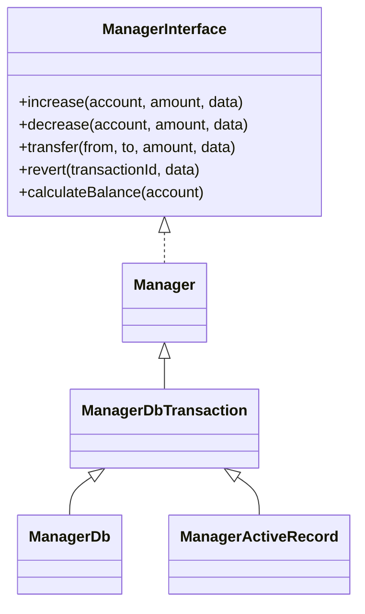
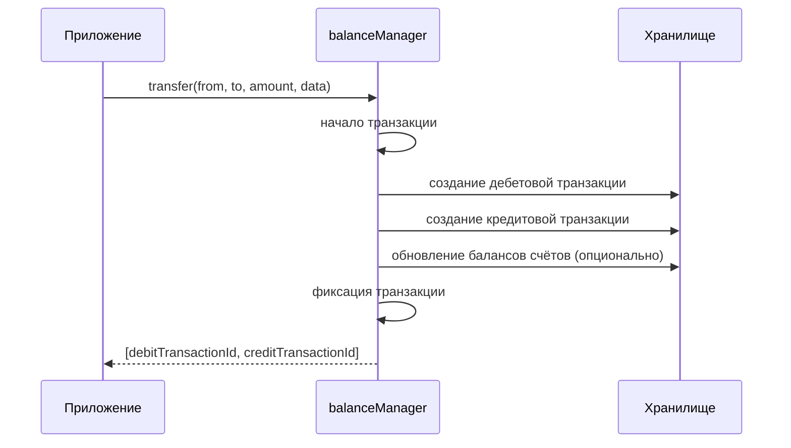
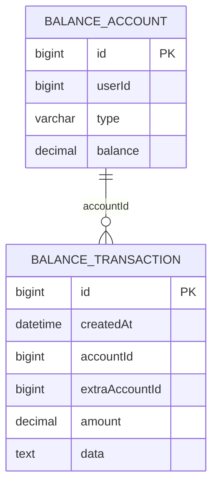
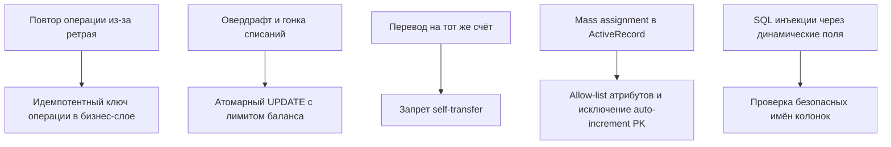

<p align="center">
    <a href="https://github.com/nazbav" target="_blank">
        
    </a>
    <h1 align="center">nazbav/yii2-account-balance</h1>
    <p align="center">Расширение для учёта балансов и проводок в Yii2 (PHP 8.1 / 8.3)</p>
</p>

## Описание

`nazbav/yii2-account-balance` реализует модель учёта на принципе дебета/кредита:

- `счёт` (`account`) хранит текущее состояние ресурса;
- `транзакция` (`transaction`) фиксирует изменение баланса;
- перевод между счётами создаёт две транзакции: списание и зачисление.

Расширение подходит для:

- денежных операций;
- бонусных/балльных систем;
- складских и внутренних учётных перемещений.

## Возможности

- операции `increase()`, `decrease()`, `transfer()`, `revert()`;
- автоматическое создание счёта по фильтру (`autoCreateAccount`);
- вычисление текущего баланса (`calculateBalance()`);
- хранение дополнительных данных транзакции с сериализацией;
- поддержка хранилищ:
  - `ManagerDb` (прямой SQL через Query/Command),
  - `ManagerActiveRecord` (через ActiveRecord);
- транзакционность операций через `ManagerDbTransaction`;
- события до и после создания транзакции.

## Требования

- PHP `^8.1` (проверено на `8.1` и `8.3`);
- Yii2 `~2.0.14`.

## Установка

```bash
composer require nazbav/yii2-account-balance --prefer-dist
```

## Архитектура



### Поток перевода



## Быстрый старт (ManagerDb)

```php
use nazbav\balance\ManagerDb;

return [
    'components' => [
        'balanceManager' => [
            'class' => ManagerDb::class,
            'accountTable' => '{{%balance_account}}',
            'transactionTable' => '{{%balance_transaction}}',
            'accountLinkAttribute' => 'accountId',
            'amountAttribute' => 'amount',
            'dateAttribute' => 'createdAt',
            'dataAttribute' => 'data',
            'accountBalanceAttribute' => 'balance',
            'extraAccountLinkAttribute' => 'extraAccountId',
        ],
    ],
];
```

Операции:

```php
$manager = Yii::$app->balanceManager;

$manager->increase(10, 500, ['reason' => 'Пополнение']);
$manager->decrease(10, 100, ['reason' => 'Списание']);
$pair = $manager->transfer(10, 20, 250, ['orderId' => 777]);
$manager->revert($pair[0], ['reason' => 'Отмена операции']);
```

## Поиск счёта по фильтру

Можно передавать массив атрибутов вместо ID. Если счёт не найден и включен `autoCreateAccount`, счёт будет создан автоматически.

```php
$manager->autoCreateAccount = true;

$manager->increase(
    ['userId' => 15, 'type' => 'wallet'],
    1000,
    ['source' => 'manual-topup']
);
```

## Работа с текущим балансом

```php
$current = $manager->calculateBalance(['userId' => 15, 'type' => 'wallet']);
```

Если задан `accountBalanceAttribute`, баланс обновляется инкрементально при каждой операции, что дешевле частого пересчёта суммы по всем транзакциям.

## Дополнительные данные транзакции

Доп. поля передаются в параметре `$data` и сохраняются в:

- отдельные колонки, если они есть в таблице транзакций;
- либо в сериализованное поле (`dataAttribute`).

```php
$manager->transfer(
    ['userId' => 15, 'type' => 'gateway'],
    ['userId' => 15, 'type' => 'wallet'],
    500,
    [
        'paymentGateway' => 'SBP',
        'paymentId' => 'P-2026-03-001',
    ]
);
```

## События

- `Manager::EVENT_BEFORE_CREATE_TRANSACTION`
- `Manager::EVENT_AFTER_CREATE_TRANSACTION`

```php
use nazbav\balance\Manager;

$manager->on(Manager::EVENT_BEFORE_CREATE_TRANSACTION, static function ($event) {
    $event->transactionData['meta'] = 'Заполнено обработчиком';
});

$manager->on(Manager::EVENT_AFTER_CREATE_TRANSACTION, static function ($event) {
    Yii::info('Создана транзакция #' . $event->transactionId, __METHOD__);
});
```

## i18n и сообщения ошибок

В расширении все сообщения исключений переведены на `Yii::t()` и вынесены в отдельный словарь.

Категория: `nazbav.balance`.

Файлы переводов:

- `messages/ru/nazbav.balance.php`
- `messages/en/nazbav.balance.php`

Расширение регистрирует источник переводов через bootstrap-класс `nazbav\balance\Bootstrap` автоматически (через `composer.json` -> `extra.bootstrap`).

## Пример схемы БД



Минимальная миграция (пример):

```php
$this->createTable('{{%balance_account}}', [
    'id' => $this->primaryKey(),
    'userId' => $this->bigInteger()->notNull(),
    'type' => $this->string(32)->notNull(),
    'balance' => $this->decimal(19, 4)->notNull()->defaultValue(0),
]);

$this->createTable('{{%balance_transaction}}', [
    'id' => $this->primaryKey(),
    'createdAt' => $this->dateTime()->notNull(),
    'accountId' => $this->bigInteger()->notNull(),
    'extraAccountId' => $this->bigInteger()->null(),
    'amount' => $this->decimal(19, 4)->notNull(),
    'data' => $this->text()->null(),
]);
```

## Безопасность

- операции записи выполняются в транзакции (`ManagerDbTransaction`);
- сериализатор PHP защищён от внедрения объектов по умолчанию (`allowedClasses = false`);
- входные суммы валидируются как числовые;
- ошибки конфигурации и бизнес-ошибки отдаются через i18n-сообщения;
- в CI доступны `phpstan`, `psalm --taint-analysis`, `composer audit`.

### Усиление Защиты От Фрода

`Manager` поддерживает базовые контроли предметной области:

- `requirePositiveAmount = true` — запрещает нулевые и отрицательные суммы во внешних операциях;
- `forbidTransferToSameAccount = true` — блокирует переводы между одинаковыми счетами;
- `forbidNegativeBalance = true` и `minimumAllowedBalance` — блокируют перерасход.

Пример жёсткой конфигурации для денежных сценариев:

```php
$manager->requirePositiveAmount = true;
$manager->forbidTransferToSameAccount = true;
$manager->forbidNegativeBalance = true;
$manager->minimumAllowedBalance = 0;
$manager->accountBalanceAttribute = 'balance';
```

Для `ManagerDb` и `ManagerActiveRecord` проверка перерасхода выполняется атомарно в `UPDATE` условиями БД.

### Риски И Защиты



## Разработка и проверки

```bash
composer test
composer analyse
composer security:taint
composer security:audit
composer qa
```

## Лицензия

BSD-3-Clause. Подробности в файле [LICENSE.md](LICENSE.md).
