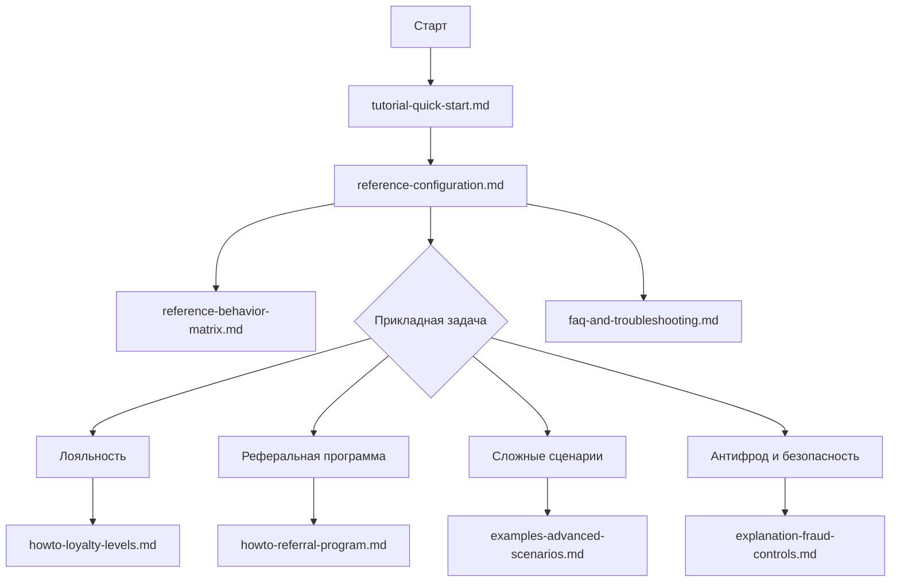

# Документация `nazbav/yii2-account-balance`

Документация сфокусирована на самой библиотеке: архитектура, API, правила безопасности и прикладные кейсы использования.

## Карта документации

1. [Быстрый старт](tutorial-quick-start.md)
2. [Архитектура и потоки данных](architecture-and-data-flow.md)
3. [Справочник конфигурации и API](reference-configuration.md)
4. [Фактическая матрица поведения](reference-behavior-matrix.md)
5. [Практика: уровни лояльности](howto-loyalty-levels.md)
6. [Практика: реферальная программа](howto-referral-program.md)
7. [Сложные прикладные сценарии](examples-advanced-scenarios.md)
8. [Модель угроз и антифрод-контроли](explanation-fraud-controls.md)
9. [FAQ и диагностика](faq-and-troubleshooting.md)

## Быстрый навигационный граф

## Матрица покрытия вопросов

| Вопрос | Где искать ответ |
|---|---|
| Как подключить и запустить за 30 минут? | `tutorial-quick-start.md` |
| Какие есть параметры и их точные эффекты? | `reference-configuration.md` |
| Где описано фактическое поведение без допущений? | `reference-behavior-matrix.md` |
| Как устроена атомарность и транзакции? | `architecture-and-data-flow.md` |
| Как безопасно внедрить программу лояльности? | `howto-loyalty-levels.md` |
| Как внедрить реферальную программу с антифродом? | `howto-referral-program.md` |
| Какие edge-case сценарии учитывать? | `examples-advanced-scenarios.md` |
| Какие угрозы и контроли обязательны? | `explanation-fraud-controls.md` |
| Что делать при типовых ошибках библиотеки? | `faq-and-troubleshooting.md` |

## Совместимость

- PHP: `8.1`, `8.3`.
- Yii2: `~2.0.14`.

## Принципы актуальности

- Документация основана на текущем коде ветки `master`.
- Любое изменение публичного поведения библиотеки сопровождается обновлением соответствующего раздела.
