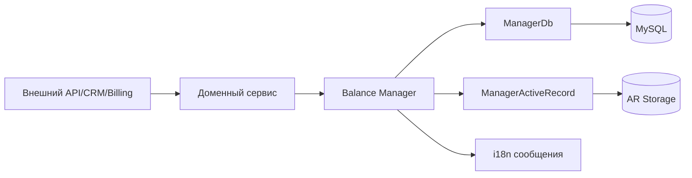
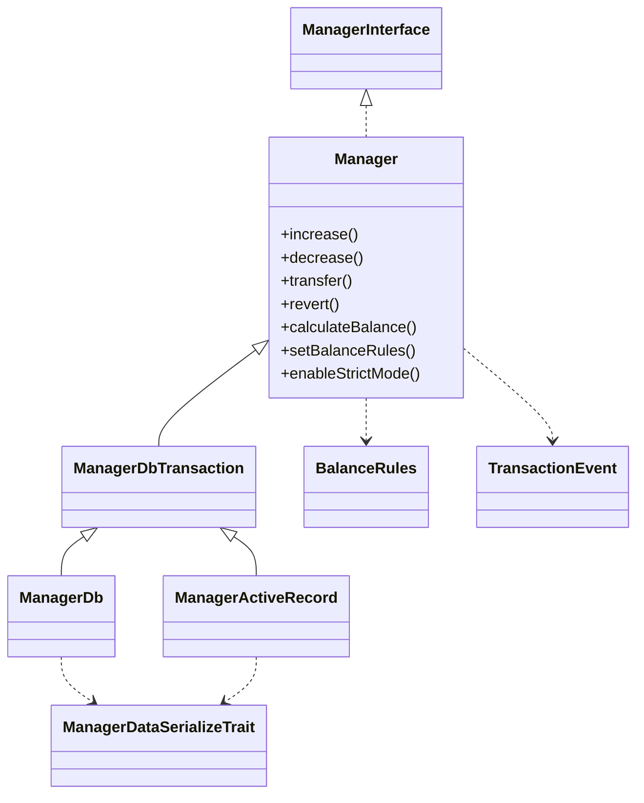
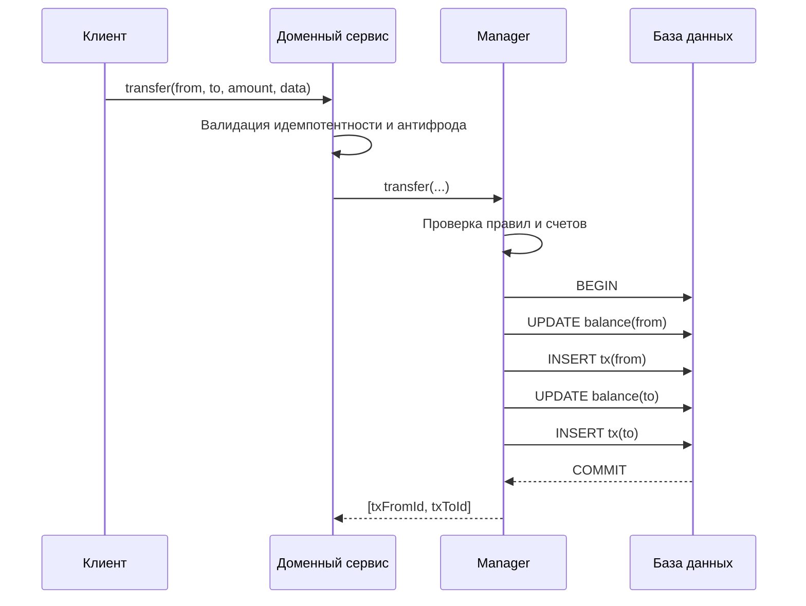
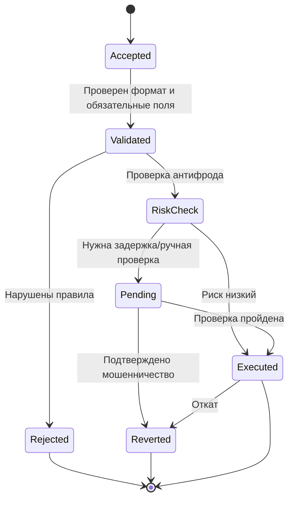
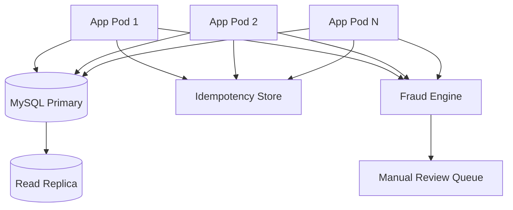

# Архитектура и потоки данных

Документ описывает фактическую архитектуру библиотеки и интеграционные контуры.

## 1. Архитектурные цели

- атомарность операций баланса;
- предсказуемая модель ошибок;
- независимость от прикладной доменной логики;
- расширяемость через события и дополнительные атрибуты транзакции.

## 2. Слои

## 3. Диаграмма классов

## 4. Поток операции `transfer`

## 5. Состояния доменной операции

## 6. Инварианты библиотеки

- сумма приводится к числу и проверяется на конечность;
- в публичных методах применяется контроль положительной суммы (если включен);
- перевод на тот же счет запрещается (если включено);
- для `increase/decrease/transfer/revert` обеспечивается транзакционность в `ManagerDbTransaction`;
- при защите от отрицательного баланса списание атомарно отклоняется при недостатке средств;
- произвольные данные транзакции восстанавливаются только как массив.

## 7. Ограничения ответственности

Библиотека не реализует самостоятельно:

- ключ идемпотентности на уровне внешнего API;
- скоринг устройства/IP/поведенческих аномалий;
- бизнес-лимиты по клиенту и периоду;
- жизненный цикл claim/dispute/refund;
- аудит и алертинг уровня компании.

Эти задачи находятся в доменном слое приложения.

## 8. Рекомендованный deployment-контур

