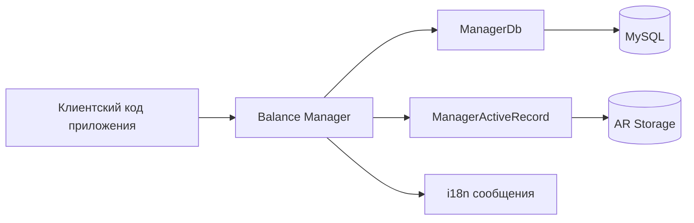
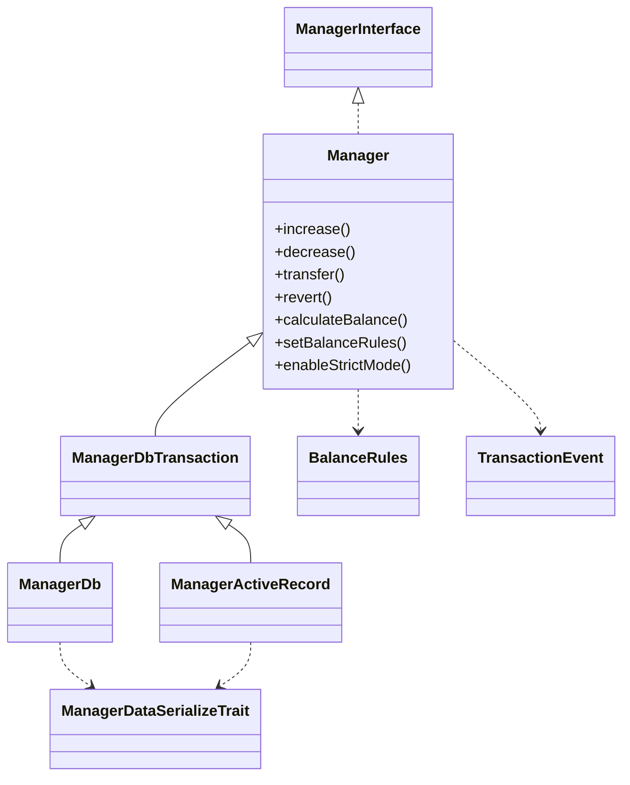
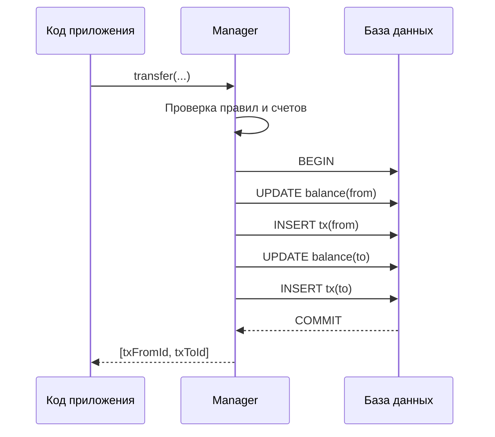
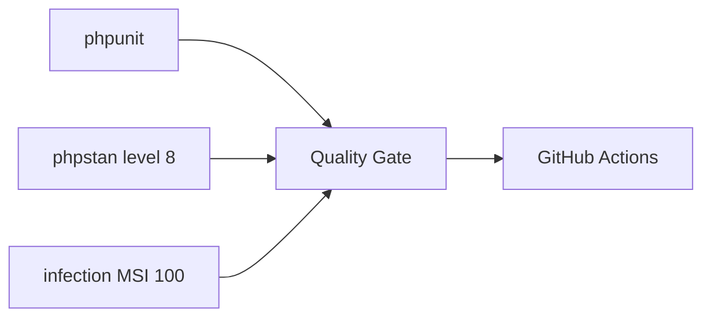

# Архитектура и потоки данных

Документ описывает фактическую архитектуру библиотеки и её внутренние контуры выполнения операций.

## 1. Архитектурные цели

- атомарность операций баланса;
- предсказуемая модель ошибок;
- независимость от прикладной доменной логики;
- расширяемость через события и дополнительные атрибуты транзакции.

## 2. Слои библиотеки

## 3. Диаграмма классов

## 4. Поток операции `transfer` внутри библиотеки

## 5. Инварианты библиотеки

- сумма приводится к числу и проверяется на конечность;
- в публичных методах применяется контроль положительной суммы (если включен);
- перевод на тот же счет запрещается (если включено);
- для `increase/decrease/transfer/revert` обеспечивается транзакционность в `ManagerDbTransaction`;
- при защите от отрицательного баланса списание атомарно отклоняется при недостатке средств;
- произвольные данные транзакции восстанавливаются только как массив.

## 6. Точки расширения библиотеки

- события:
  - `Manager::EVENT_BEFORE_CREATE_TRANSACTION`;
  - `Manager::EVENT_AFTER_CREATE_TRANSACTION`;
- выбор backend-реализации:
  - `ManagerDb`;
  - `ManagerActiveRecord`;
- настройка правил через `BalanceRules` и `enableStrictMode()`.

## 7. Контур качества

