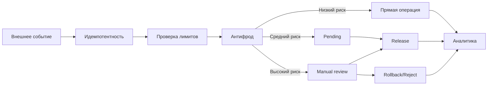

# Сложные прикладные сценарии

Ниже приведены расширенные кейсы для корпоративных программ лояльности и внутренних расчетов.

## 1. Покупка + отложенное начисление + release

```php
$pendingTxId = $manager->increase(
    ['userId' => $userId, 'walletType' => 'bonus_pending'],
    $bonusAmount,
    [
        'operationId' => "order:$orderId:bonus_pending",
        'operationType' => 'purchase_bonus_pending',
        'riskWindowDays' => 14,
    ]
);

$manager->transfer(
    ['userId' => $userId, 'walletType' => 'bonus_pending'],
    ['userId' => $userId, 'walletType' => 'bonus_available'],
    $bonusAmount,
    [
        'operationId' => "order:$orderId:bonus_release",
        'operationType' => 'purchase_bonus_release',
        'sourceTransactionId' => $pendingTxId,
    ]
);
```

## 2. Частичный возврат заказа

```php
$manager->decrease(
    ['userId' => $userId, 'walletType' => 'bonus_available'],
    $rollbackAmount,
    [
        'operationId' => "refund:$refundId:bonus_partial_rollback",
        'operationType' => 'refund_bonus_partial_rollback',
        'refundId' => $refundId,
    ]
);
```

## 3. Семейный пул бонусов

```php
$manager->transfer(
    ['userId' => $memberUserId, 'walletType' => 'bonus_available'],
    ['familyId' => $familyId, 'walletType' => 'family_pool'],
    $amount,
    [
        'operationId' => "family:$familyId:contribution:$memberUserId:$eventId",
        'operationType' => 'family_pool_contribution',
        'eventId' => $eventId,
    ]
);
```

## 4. Холд и последующий capture

```php
$holdTxId = $manager->transfer(
    ['userId' => $userId, 'walletType' => 'bonus_available'],
    ['userId' => $userId, 'walletType' => 'bonus_hold'],
    $holdAmount,
    [
        'operationId' => "checkout:$checkoutId:hold",
        'operationType' => 'bonus_hold_create',
    ]
);

$manager->transfer(
    ['userId' => $userId, 'walletType' => 'bonus_hold'],
    ['userId' => $userId, 'walletType' => 'bonus_spent'],
    $holdAmount,
    [
        'operationId' => "checkout:$checkoutId:capture",
        'operationType' => 'bonus_hold_capture',
        'sourceTransfer' => $holdTxId,
    ]
);
```

## 5. Отмена холда

```php
$manager->transfer(
    ['userId' => $userId, 'walletType' => 'bonus_hold'],
    ['userId' => $userId, 'walletType' => 'bonus_available'],
    $holdAmount,
    [
        'operationId' => "checkout:$checkoutId:release",
        'operationType' => 'bonus_hold_release',
    ]
);
```

## 6. Реферальная награда в несколько этапов

```php
$manager->increase(
    ['userId' => $referrerUserId, 'walletType' => 'referral_pending'],
    300,
    [
        'operationId' => "ref:$programId:$referrerUserId:$referredUserId:pending",
        'operationType' => 'referral_pending',
    ]
);

$manager->transfer(
    ['userId' => $referrerUserId, 'walletType' => 'referral_pending'],
    ['userId' => $referrerUserId, 'walletType' => 'bonus_available'],
    300,
    [
        'operationId' => "ref:$programId:$referrerUserId:$referredUserId:release",
        'operationType' => 'referral_release',
    ]
);
```

## 7. Корректировка по служебному тикету

```php
$manager->increase(
    ['userId' => $userId, 'walletType' => 'bonus_available'],
    $adjustment,
    [
        'operationId' => "support:$ticketId:adjustment",
        'operationType' => 'support_adjustment',
        'ticketId' => $ticketId,
        'authorRole' => 'support_l2',
    ]
);
```

## 8. Диаграмма общего жизненного цикла



## 9. Защита от повторного начисления (idempotency/anti-replay)

```php
$manager->increase(
    ['userId' => $userId, 'walletType' => 'bonus_available'],
    50,
    [
        'operationId' => "campaign:$campaignId:user:$userId",
        'operationType' => 'campaign_bonus',
    ]
);

// Повтор того же события с тем же operationId:
$manager->increase(
    ['userId' => $userId, 'walletType' => 'bonus_available'],
    50,
    [
        'operationId' => "campaign:$campaignId:user:$userId",
        'operationType' => 'campaign_bonus',
    ]
);
```

При `forbidDuplicateOperationId=true` второй вызов завершится `InvalidArgumentException` (`error.duplicate_operation_id`), а повторное начисление не будет создано.
