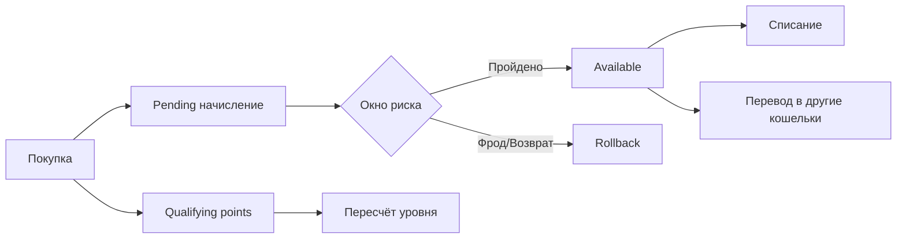

# Сложные Примеры: Начисления, Холды, Возвраты, Уровни

Ниже собраны практические end-to-end сценарии для e-commerce и loyalty-доменов.

## Сценарий 1. Покупка + бонусы + окно возврата

**Задача:**

- начислить 10% бонусов за заказ;
- не давать тратить их до окончания окна возврата (14 дней);
- после окна перевести в доступный баланс.

```php
$bonusPending = round($orderAmount * 0.10, 2);

$pendingTxId = $manager->increase(
    ['userId' => $userId, 'walletType' => 'bonus_pending'],
    $bonusPending,
    [
        'operationType' => 'purchase_bonus_pending',
        'orderId' => $orderId,
        'riskWindowDays' => 14,
        'operationId' => "order:$orderId:bonus-pending",
    ]
);

// ... через 14 дней и после проверок
$manager->transfer(
    ['userId' => $userId, 'walletType' => 'bonus_pending'],
    ['userId' => $userId, 'walletType' => 'bonus_available'],
    $bonusPending,
    [
        'operationType' => 'purchase_bonus_release',
        'sourceTransactionId' => $pendingTxId,
        'operationId' => "order:$orderId:bonus-release",
    ]
);
```

## Сценарий 2. Уровни лояльности с коэффициентом начисления

Коэффициенты по уровням:

- Bronze: `1.0x`
- Silver: `1.2x`
- Gold: `1.5x`
- Platinum: `2.0x`

```php
$multiplier = match ($tier) {
    'platinum' => 2.0,
    'gold' => 1.5,
    'silver' => 1.2,
    default => 1.0,
};

$baseBonus = round($orderAmount * 0.05, 2);
$finalBonus = round($baseBonus * $multiplier, 2);

$manager->increase(
    ['userId' => $userId, 'walletType' => 'bonus_pending'],
    $finalBonus,
    [
        'operationType' => 'tiered_bonus_pending',
        'tier' => $tier,
        'multiplier' => $multiplier,
        'orderId' => $orderId,
    ]
);
```

## Сценарий 3. Списание бонусов в оплату заказа

```php
$manager->decrease(
    ['userId' => $userId, 'walletType' => 'bonus_available'],
    $redeemAmount,
    [
        'operationType' => 'order_redeem',
        'orderId' => $orderId,
        'operationId' => "order:$orderId:redeem",
    ]
);
```

Если средств не хватает и включён `forbidNegativeBalance`, операция завершится ошибкой.

## Сценарий 4. Возврат заказа и откат бонусов

```php
$manager->revert($pendingTxId, [
    'operationType' => 'order_refund_rollback',
    'orderId' => $orderId,
    'reason' => 'refund',
]);
```

## Сценарий 5. Реферальная программа (короткий практический поток)

```php
// 1) Награда в pending.
$manager->increase(
    ['userId' => $referrerUserId, 'walletType' => 'referral_pending'],
    300,
    [
        'operationType' => 'referral_reward_pending',
        'operationId' => "ref:$referrerUserId:$referredUserId",
        'referrerUserId' => $referrerUserId,
        'referredUserId' => $referredUserId,
    ]
);

// 2) После антифрод-проверок release в доступный кошелёк.
$manager->transfer(
    ['userId' => $referrerUserId, 'walletType' => 'referral_pending'],
    ['userId' => $referrerUserId, 'walletType' => 'bonus_available'],
    300,
    ['operationType' => 'referral_reward_release']
);
```

Полная версия с правилами и ограничениями: [How-to: Реферальная Программа](howto-referral-program.md).

## Сценарий 6. Семейный/групповой пул бонусов

Принцип: личные кошельки участников + общий кошелёк семьи.

```php
$manager->transfer(
    ['userId' => $memberUserId, 'walletType' => 'bonus_available'],
    ['familyId' => $familyId, 'walletType' => 'family_pool'],
    200,
    [
        'operationType' => 'family_pool_contribution',
        'memberUserId' => $memberUserId,
    ]
);
```

## Диаграмма общего цикла лояльности


