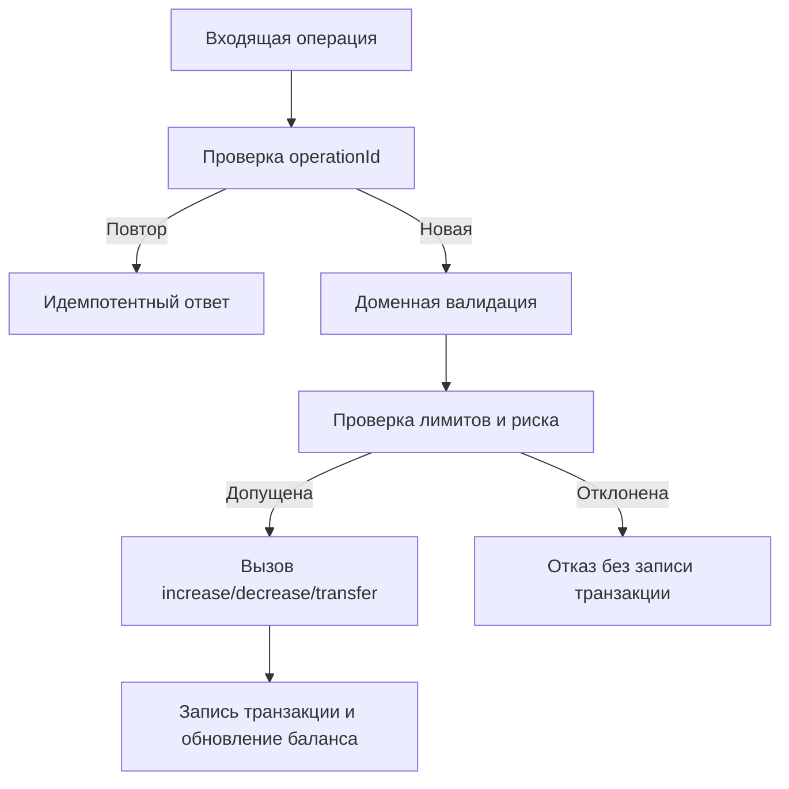

# Модель угроз и антифрод-контроли

Документ фиксирует риски предметной области и рекомендуемые меры защиты при использовании библиотеки.

## 1. Ключевые угрозы

1. Повтор операции (retry/webhook replay/race condition).
2. Перерасход баланса в конкурентных списаниях.
3. Накрутка оборота через циклические переводы.
4. Саморефералы и мультиаккаунты.
5. Быстрый вывод бонусов без окна риска.
6. Массовые злоупотребления акциями и промокодами.
7. Вставка нежелательных полей в транзакцию.
8. Внедрение объектов при небезопасной сериализации.

## 2. Что закрывается в библиотеке

- проверка суммы на тип и конечность;
- опциональное требование положительной суммы;
- запрет перевода на тот же счет;
- атомарная защита от отрицательного баланса (`forbidNegativeBalance`);
- транзакционный контур операций;
- валидация имён колонок при динамических SQL-участках;
- безопасное поведение `PhpSerializer` по умолчанию.

## 3. Что нужно закрывать в доменном слое

1. Идемпотентность по `operationId`.
2. Антифрод-скоринг (`riskScore`, `deviceHash`, `ipHash`, `geo`).
3. Лимиты по сумме/частоте/каналу/сегменту.
4. Проверка аномалий по времени и поведенческому профилю.
5. Ручная проверка high-risk кейсов.
6. Выделенный процесс `pending -> release -> rollback`.
7. Раздельные алерты для операций лояльности и реферальной программы.

## 4. Базовый профиль безопасного использования библиотеки

```php
'requirePositiveAmount' => true,
'forbidTransferToSameAccount' => true,
'forbidNegativeBalance' => true,
'minimumAllowedBalance' => 0,
'accountBalanceAttribute' => 'balance',
```

Дополнительно:

- обязательный `operationId` для внешних команд;
- раздельные кошельки `pending/available/spent`;
- доменные лимиты на операции по сумме и частоте.

## 5. Поток обработки операции с антифрод-валидацией



## 6. Контрольный список библиотечного контура

- включены строгие флаги защиты в конфигурации;
- реализован уникальный ключ `operationId`;
- заданы доменные лимиты и сегментация кошельков;
- покрыты тестами позитивные, негативные и граничные кейсы операций.

## 7. Внешние практические ориентиры

- OWASP SQL Injection Prevention Cheat Sheet:
  - https://cheatsheetseries.owasp.org/cheatsheets/SQL_Injection_Prevention_Cheat_Sheet.html
- OWASP Mass Assignment Cheat Sheet:
  - https://cheatsheetseries.owasp.org/cheatsheets/Mass_Assignment_Cheat_Sheet.html
- Stripe Idempotent Requests:
  - https://docs.stripe.com/api/idempotent_requests
