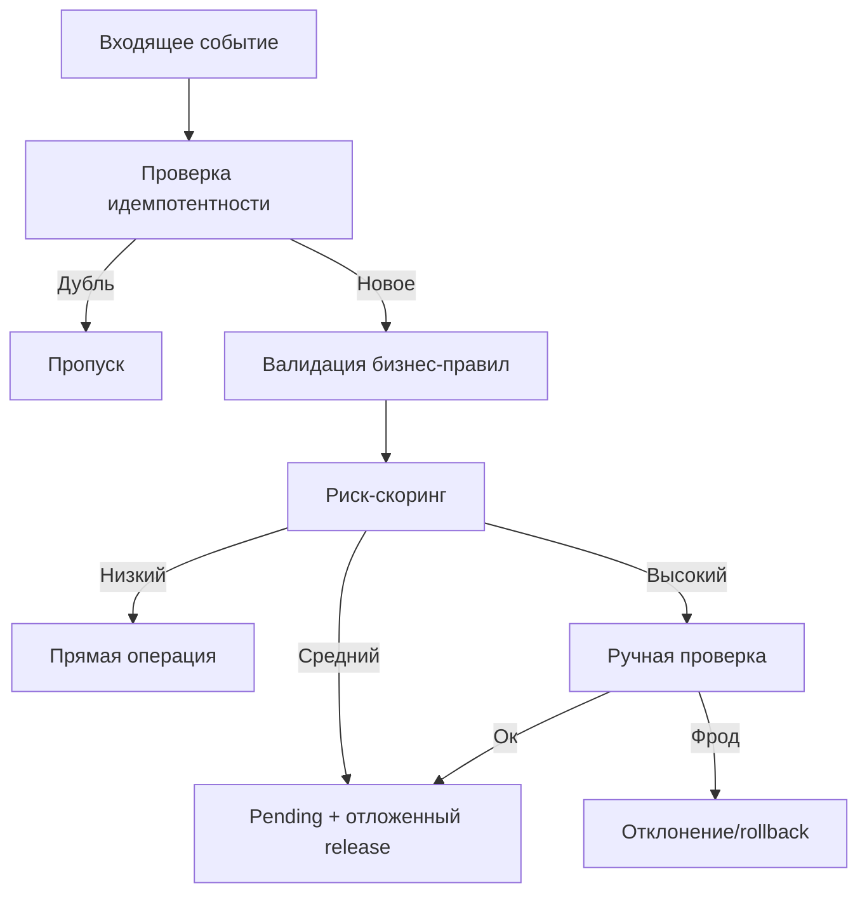

# Explanation: Риски, Антифрод И Защита Бизнес-Логики

## Основные риски в loyalty и реферальных программах

1. Повтор операции (ретрай, гонка, повторный webhook).
2. Перерасход баланса при конкурентных списаниях.
3. Self-transfer и циклические переводы для накрутки оборота.
4. Self-referral и мультиаккаунты в реферальных механиках.
5. Быстрый вывод бонусов до завершения окна риска.
6. Злоупотребление акциями и промо-кодами (promotion abuse).

## Что уже закрывает библиотека

- проверка корректности суммы и запрет невалидных величин;
- запрет `transfer` между одинаковыми счётами;
- защита от отрицательного баланса при корректной конфигурации;
- транзакционность операций;
- i18n-ошибки для предсказуемой обработки в приложении.

## Что должно быть в доменном слое поверх библиотеки

1. Идемпотентность
- уникальный `operationId` в транзакционных данных;
- таблица или key-store обработанных операций.

2. Скоринг риска
- `riskScore`, `ipHash`, `deviceHash`, `fingerprintId`, `geo`;
- уровень риска влияет на окно `pending` и ручную проверку.

3. Ограничители (velocity/amount caps)
- максимум начислений и списаний за период;
- отдельные лимиты для новых аккаунтов.

4. Контроль рефералок
- запрет self-referral;
- дедупликация пары `referrer-referred-program`;
- отложенная активация награды;
- лимиты успешных рефералов.

5. Наблюдаемость
- отдельные алерты на аномалии;
- журналы риск-событий;
- раздельная аналитика pending/released/rollback.

## Рекомендуемая архитектура принятия решения

## Практический baseline для продакшена

- `requirePositiveAmount=true`
- `forbidTransferToSameAccount=true`
- `forbidNegativeBalance=true`
- `minimumAllowedBalance=0`
- обязательный `operationId` в каждой внешней операции
- окна риска для рефералок и бонусов за покупки

## Внешние ориентиры, которые стоит учитывать

- OWASP SQL Injection Prevention Cheat Sheet
  - https://cheatsheetseries.owasp.org/cheatsheets/SQL_Injection_Prevention_Cheat_Sheet.html
- OWASP Mass Assignment Cheat Sheet
  - https://cheatsheetseries.owasp.org/cheatsheets/Mass_Assignment_Cheat_Sheet.html
- FTC Endorsement Guides (реклама и рекомендации в реферальных механиках)
  - https://www.ftc.gov/business-guidance/resources/ftcs-endorsement-guides
- Stripe Idempotent Requests (подход к идемпотентности API-операций)
  - https://docs.stripe.com/api/idempotent_requests
- Referral Rock: типичные схемы реферального фрода
  - https://referralrock.com/blog/referral-fraud/
- ReferralCandy: способы предотвращения self-referral и злоупотреблений
  - https://www.referralcandy.com/blog/referral-fraud
