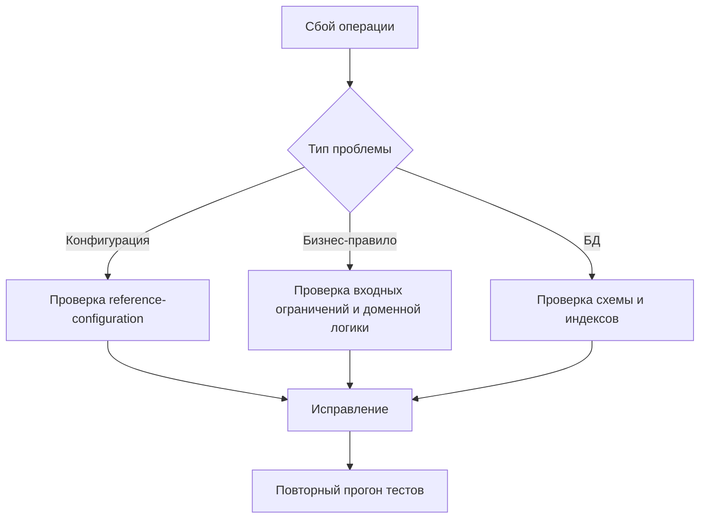

# FAQ и диагностика

## 1. Почему при `forbidNegativeBalance=true` операция все равно проходит?

Проверить:

1. задан ли `accountBalanceAttribute`;
2. корректно ли заполняется поле баланса в таблице счетов;
3. нет ли конкурирующей логики обновления баланса вне менеджера.

Если `accountBalanceAttribute` не задан, библиотека выбросит `InvalidConfigException` при попытке списания.

## 2. Почему `revert()` возвращает ошибку `transaction_not_found`?

Причины:

- неверный `transactionId`;
- транзакция отсутствует в используемой таблице;
- запись создавалась другим менеджером/конфигурацией таблиц.

Проверить источник `transactionId` и согласованность параметров `transactionTable`/`transactionClass`.

## 3. Как избежать дублей операций при повторной доставке внешней команды?

Библиотека не создает глобальный ключ идемпотентности сама. Рекомендуется:

1. хранить `operationId` в отдельной таблице домена;
2. держать уникальный индекс по `operationId`;
3. вызывать `increase/decrease/transfer` только после успешной проверки ключа.

## 4. Как безопасно использовать `PhpSerializer`?

- оставить `allowedClasses=false` (значение по умолчанию);
- не принимать сериализованные payload из недоверенных источников;
- при whitelist-режиме явно задавать допустимые классы.

## 5. Как правильно хранить денежные значения?

Рекомендуется:

- в БД использовать `DECIMAL(19,4)`;
- в доменной логике придерживаться единой точности;
- избегать смешивания целых и дробных сумм без общего стандарта округления.

## 6. Какие тесты добавлять на новую бизнес-логику?

На каждый новый участок:

- минимум один позитивный тест;
- минимум один негативный тест;
- тест на граничный случай (лимит, порог, крайний статус);
- при работе с `data`/сериализацией — отдельный тест безопасности payload.

## 7. Диаграмма диагностики проблем

## 8. Как сейчас работает транзакционность `decrease()`?

В текущей версии `decrease()` обернут в `begin/commit/rollback` в `ManagerDbTransaction` так же, как `increase()`, `transfer()` и `revert()`.

Если нужна единая транзакция на несколько доменных действий, внешний сервис может открыть собственную транзакцию и вызывать менеджер внутри нее.
