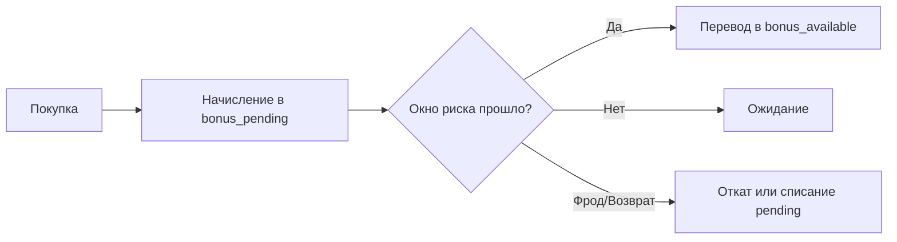

# How-to: Уровни И Программы Лояльности

Этот документ показывает, как использовать библиотеку для multi-wallet лояльности с уровнями (Bronze/Silver/Gold/Platinum).

## Целевая модель

Рекомендуется вести минимум три кошелька на клиента:

- `bonus_pending` — начислено, но ещё не подтверждено (окно возврата/фрода);
- `bonus_available` — доступно к списанию;
- `qualifying_points` — квалификационные баллы для уровня.

## Пороговые уровни (пример)

- Bronze: `0+`
- Silver: `1000+`
- Gold: `5000+`
- Platinum: `15000+`

## Базовый поток начисления за покупку

```php
$manager = Yii::$app->balanceManager;

$userFilter = ['userId' => $userId];

// 1) Начисление в pending.
$pendingTx = $manager->increase($userFilter + ['walletType' => 'bonus_pending'], $bonusAmount, [
    'operationType' => 'purchase_bonus_pending',
    'orderId' => $orderId,
    'tierAtOperation' => $currentTier,
]);

// 2) Начисление в qualifying points (сразу).
$manager->increase($userFilter + ['walletType' => 'qualifying_points'], $qualifyingAmount, [
    'operationType' => 'qualifying_accrual',
    'orderId' => $orderId,
]);
```

## Подтверждение pending -> available

После окна риска (например, 14 дней) переводим сумму из `bonus_pending` в `bonus_available`.

```php
$manager->transfer(
    ['userId' => $userId, 'walletType' => 'bonus_pending'],
    ['userId' => $userId, 'walletType' => 'bonus_available'],
    $confirmAmount,
    [
        'operationType' => 'pending_release',
        'sourceOperationId' => $operationId,
    ]
);
```

## Повышение уровня

```php
$qualifyingBalance = $manager->calculateBalance([
    'userId' => $userId,
    'walletType' => 'qualifying_points',
]);

$newTier = match (true) {
    $qualifyingBalance >= 15000 => 'platinum',
    $qualifyingBalance >= 5000 => 'gold',
    $qualifyingBalance >= 1000 => 'silver',
    default => 'bronze',
};
```

## Списание с ограничением перерасхода

В конфигурации должен быть включён запрет отрицательного баланса:

```php
'forbidNegativeBalance' => true,
'minimumAllowedBalance' => 0,
'accountBalanceAttribute' => 'balance',
```

Тогда списание будет отклонено автоматически, если баланса недостаточно.

## Годовой сброс квалификации (пример)

```php
// Сохраняем историю уровня вне balance-таблиц (в своей доменной таблице).
// Затем обнуляем/пересчитываем qualifying points по вашей политике.
$manager->decrease(
    ['userId' => $userId, 'walletType' => 'qualifying_points'],
    $currentQualifyingBalance,
    ['operationType' => 'yearly_reset']
);
```

## Диаграмма жизненного цикла бонусов


