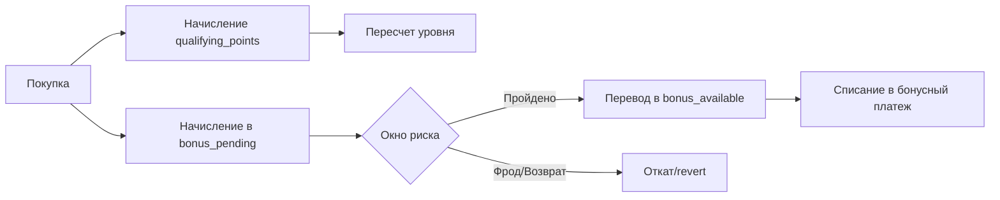

# Практика: уровни лояльности

Документ показывает, как построить многоуровневую программу лояльности поверх библиотеки.

## 1. Рекомендуемая модель кошельков

- `bonus_pending` — начислено, но еще не доступно;
- `bonus_available` — доступно для списания;
- `bonus_spent` — аналитический кошелек списаний;
- `qualifying_points` — квалификационные баллы для уровня.

Обязательные защитные флаги менеджера:

```php
'forbidDuplicateOperationId' => true,
'requireOperationId' => true,
'operationIdAttribute' => 'operationId',
'forbidNegativeBalance' => true,
'accountBalanceAttribute' => 'balance',
```

## 2. Правила уровней (пример)

| Уровень | Диапазон qualifying points | Множитель бонуса |
|---|---:|---:|
| Bronze | 0 - 999 | 1.00 |
| Silver | 1000 - 4999 | 1.20 |
| Gold | 5000 - 14999 | 1.50 |
| Platinum | 15000+ | 2.00 |

## 3. Начисление за заказ

```php
$multiplier = match ($tier) {
    'platinum' => 2.0,
    'gold' => 1.5,
    'silver' => 1.2,
    default => 1.0,
};

$baseBonus = round($orderAmount * 0.05, 2);
$finalBonus = round($baseBonus * $multiplier, 2);

$manager->increase(
    ['userId' => $userId, 'walletType' => 'bonus_pending'],
    $finalBonus,
    [
        'operationId' => "order:$orderId:bonus_pending",
        'operationType' => 'purchase_bonus_pending',
        'tierAtPurchase' => $tier,
        'multiplier' => $multiplier,
    ]
);

$manager->increase(
    ['userId' => $userId, 'walletType' => 'qualifying_points'],
    (int) floor($orderAmount),
    [
        'operationId' => "order:$orderId:qualifying",
        'operationType' => 'qualifying_points_accrual',
    ]
);
```

## 4. Освобождение pending-бонусов

```php
$manager->transfer(
    ['userId' => $userId, 'walletType' => 'bonus_pending'],
    ['userId' => $userId, 'walletType' => 'bonus_available'],
    $releaseAmount,
    [
        'operationId' => "order:$orderId:bonus_release",
        'operationType' => 'bonus_release',
    ]
);
```

## 5. Списание бонусов в заказ

```php
$manager->transfer(
    ['userId' => $userId, 'walletType' => 'bonus_available'],
    ['userId' => $userId, 'walletType' => 'bonus_spent'],
    $redeemAmount,
    [
        'operationId' => "order:$orderId:bonus_redeem",
        'operationType' => 'bonus_redeem',
    ]
);
```

## 6. Пересчет уровня

```php
$qualifyingBalance = $manager->calculateBalance([
    'userId' => $userId,
    'walletType' => 'qualifying_points',
]);

$newTier = match (true) {
    $qualifyingBalance >= 15000 => 'platinum',
    $qualifyingBalance >= 5000 => 'gold',
    $qualifyingBalance >= 1000 => 'silver',
    default => 'bronze',
};
```

## 7. Edge-кейсы, которые нужно закрыть

1. Повторное событие оплаты (повтор webhook).
2. Частичный возврат заказа.
3. Полный возврат после release бонусов.
4. Изменение уровня между начислением и release.
5. Ручная корректировка оператора.

## 8. Диаграмма цикла лояльности


