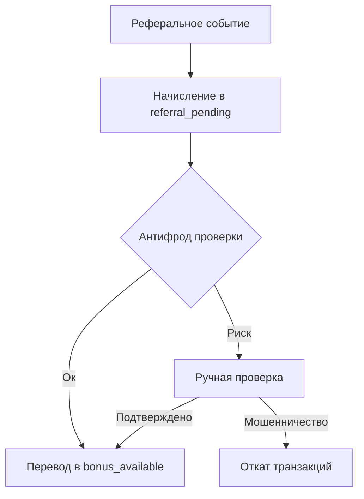

# Практика: реферальная программа

Этот кейс показывает, как реализовать реферальную механику поверх `nazbav/yii2-account-balance`.

## Бизнес-модель (рекомендуемый базовый вариант)

- Двусторонняя награда:
  - награда пригласившему;
  - награда приглашённому.
- Награда сначала попадает в `referral_pending`.
- После прохождения окна риска переводится в `bonus_available`.

## Почему так

Реферальные программы чаще всего атакуют через:

- саморефералы (один человек создаёт второй аккаунт);
- мультиаккаунты и «фермы устройств»;
- накрутку через повторные/дробные операции;
- быстрый вывод бонусов сразу после начисления.

Отложенная активация + лимиты + проверка источника существенно снижают риск.

## Рекомендуемые кошельки

- `referral_pending`
- `bonus_available`
- `referral_spent` (опционально для отдельной аналитики)

## Шаг 1. Фиксация реферального события

```php
$operationId = sprintf('ref-%s-%s', $referrerUserId, $referredUserId);

// Награда пригласившему в pending.
$manager->increase(
    ['userId' => $referrerUserId, 'walletType' => 'referral_pending'],
    $referrerReward,
    [
        'operationType' => 'referral_reward_pending',
        'operationId' => $operationId,
        'referrerUserId' => $referrerUserId,
        'referredUserId' => $referredUserId,
        'programId' => 'ref-2026-q1',
    ]
);

// Награда приглашённому в pending.
$manager->increase(
    ['userId' => $referredUserId, 'walletType' => 'referral_pending'],
    $referredReward,
    [
        'operationType' => 'referral_welcome_pending',
        'operationId' => $operationId,
        'referrerUserId' => $referrerUserId,
        'referredUserId' => $referredUserId,
        'programId' => 'ref-2026-q1',
    ]
);
```

## Шаг 2. Проверки антифрода до активации

Минимальный набор правил в доменном сервисе:

1. Запрет саморефералов (`referrerUserId !== referredUserId`).
2. Запрет повтора пары (`referrerUserId`, `referredUserId`, `programId`).
3. Лимит наград на период (например, не более N успешных рефералов в месяц).
4. Проверка риска устройства/IP/email-домена.
5. Минимальное целевое действие приглашённого (например, первая оплаченная покупка > X).

## Шаг 3. Активация награды после окна риска

```php
$manager->transfer(
    ['userId' => $referrerUserId, 'walletType' => 'referral_pending'],
    ['userId' => $referrerUserId, 'walletType' => 'bonus_available'],
    $confirmedAmount,
    [
        'operationType' => 'referral_reward_release',
        'operationId' => $operationId,
    ]
);
```

## Шаг 4. Откат при фроде или отмене целевого действия

```php
$manager->revert($transactionIdToRollback, [
    'operationType' => 'referral_rollback',
    'reason' => 'Обнаружены признаки мошенничества или чарджбэк',
]);
```

## Связка с уровнями лояльности

Типовой вариант:

- реферальные бонусы можно тратить, но они не влияют на `qualifying_points`;
- для Gold/Platinum можно повышать лимит реферальных наград;
- для новых аккаунтов можно включать усиленную проверку (более длинное окно ожидания, `pending`).

## Mermaid-схема потока



## Важные технические замечания

- Идемпотентность делайте на уровне доменного сервиса через уникальный `operationId`.
- Не начисляйте и не активируйте награду в одном и том же шаге.
- Критичные проверки (лимиты, уникальность, статус) храните в собственной доменной таблице правил/событий.
