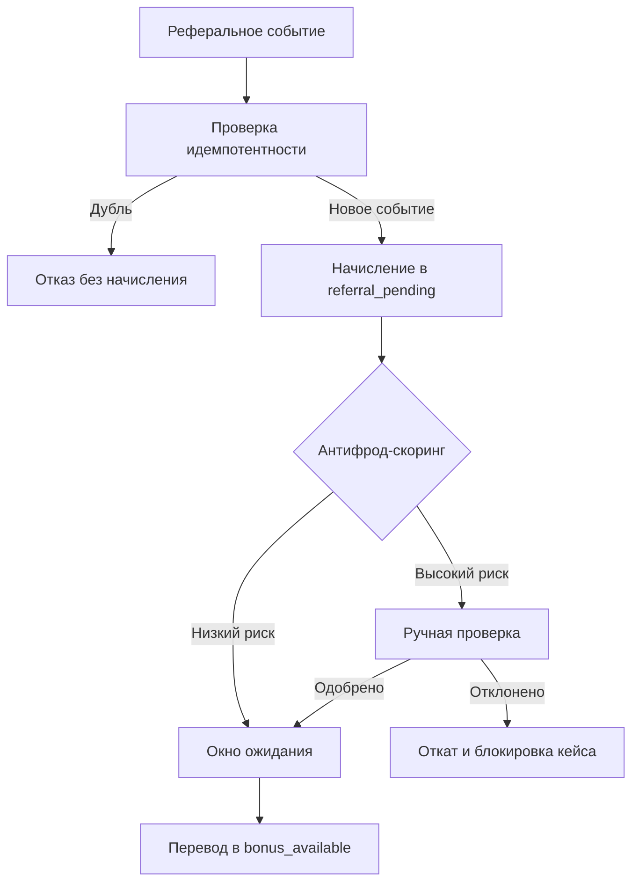

# Практика: реферальная программа

Документ описывает безопасный сценарий реферальной программы как один из прикладных кейсов.

## 1. Целевая модель

- двусторонняя награда: пригласивший + приглашенный;
- начисление всегда начинается в `referral_pending`;
- активация после окна риска и проверок;
- хранение причин отклонения/отката в `data`.

## 2. Кошельки

- `referral_pending`;
- `bonus_available`;
- `referral_spent` (опционально для аналитики).

Рекомендуемая базовая конфигурация менеджера для реферальных начислений:

```php
'forbidDuplicateOperationId' => true,
'requireOperationId' => true,
'operationIdAttribute' => 'operationId',
'forbidNegativeBalance' => true,
'accountBalanceAttribute' => 'balance',
```

## 3. Базовый поток

### Шаг 1. Создание pending-начислений

```php
$operationId = sprintf('ref:%d:%d:%s', $referrerUserId, $referredUserId, $programId);

$manager->increase(
    ['userId' => $referrerUserId, 'walletType' => 'referral_pending'],
    $referrerReward,
    [
        'operationId' => $operationId,
        'operationType' => 'referral_reward_pending',
        'programId' => $programId,
        'referrerUserId' => $referrerUserId,
        'referredUserId' => $referredUserId,
    ]
);

$manager->increase(
    ['userId' => $referredUserId, 'walletType' => 'referral_pending'],
    $referredReward,
    [
        'operationId' => $operationId . ':welcome',
        'operationType' => 'referral_welcome_pending',
        'programId' => $programId,
        'referrerUserId' => $referrerUserId,
        'referredUserId' => $referredUserId,
    ]
);
```

### Шаг 2. Проверки антифрода

Минимальный набор правил:

1. запрет самореферала (`referrerUserId !== referredUserId`);
2. уникальность пары (`referrer`, `referred`, `programId`);
3. минимальное целевое действие приглашенного (например, оплаченный заказ);
4. лимит подтвержденных рефералов за период;
5. проверка device fingerprint / IP / поведенческих аномалий.

Техническая рекомендация по БД:

- индекс `(accountId, operationId)` в таблице транзакций обязателен для стабильной производительности anti-duplicate проверки.

### Шаг 3. Активация вознаграждения

```php
$manager->transfer(
    ['userId' => $referrerUserId, 'walletType' => 'referral_pending'],
    ['userId' => $referrerUserId, 'walletType' => 'bonus_available'],
    $confirmedAmount,
    [
        'operationId' => $operationId . ':release',
        'operationType' => 'referral_reward_release',
    ]
);
```

### Шаг 4. Откат при фроде/чарджбэке

```php
$manager->revert($transactionId, [
    'operationType' => 'referral_rollback',
    'reason' => 'Выявлены признаки мошенничества',
]);
```

## 4. Связка с уровнями лояльности

- реферальные бонусы можно разрешить к списанию, но не учитывать в `qualifying_points`;
- для старших уровней можно повышать месячный лимит наград;
- для новых аккаунтов можно увеличивать `pending`-период.

## 5. Схема принятия решения



## 6. KPI для мониторинга

- доля отклоненных рефералов;
- доля повторных попыток с тем же устройством;
- медиана времени от pending до release;
- доля manual-review кейсов;
- финансовая нагрузка на программу по сегментам.
